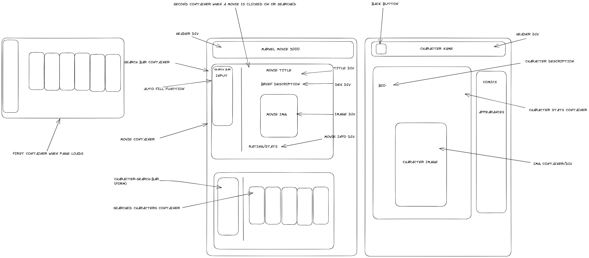

# __MARVEL MOVIE 3000__ 🦾🤖🎥

## __Table of Contents__ 🐜👨🏻
- [Overview](#overview-🕷👨)
 - [The Challenge](#the-challenge-👨😡💪🍏)
 - [Screenshots](#screenshots-🖐🏼🌀🧛🏻‍♂️)
 - [Links](#links-🩸🧙‍♀️)
- [Our Process](#our-process-⍟🦸‍♂️)
 - [Built With](#built-with-🦅👁)
 - [What We Learned](#what-we-learned-🔫👱‍♂️🎧🎶)
 - [Continued development](#continued-development)
 - [Useful resources](#useful-resources)
- [Authors](#author)
- [Acknowledgments](#acknowledgments)
<hr>

## __Overview__ 🕷👨 
​MARVEL MOVIE 3000 allows the user to search for movies and characters related to the Marvel Universe.
<hr>
<br>

### __The Challenge__ 👨😡💪🍏
​
___Users should be able to___:
​
- Type a movie or a character from Marvel that they would like to get information about.

- Also, they should be able to click on the movie or character cards to generate information that way if they want to.

<hr>
<br>

### __Screenshots__ 🖐🏼🌀🧛🏻‍♂️
<br>


<hr>
<br>


<hr>
<br>


<hr>
<br>
<br>

### __Links__ 🩸🧙‍♀️

- Our Repository: [Github Repo](https://github.com/appleschaussaa/marvel-movies-3000)
- Published Webpage: [See it in Action!](https://your-live-site-url.com)

​<hr>
<br>

## __Our Process__ ⍟🦸‍♂️

* Started off using Excalidraw to create a wireframe


* Once the wireframing was done, we split up the work that needed to be done

* An index.html and a character.html were created

* We decided to use Foundation as our framework and started styling our pages

* Once the html and styling were almost completed the javascript was started

* Script files were created for the index page and as well as the character page. A third one was created as well which is titled md5.js and the reason for this file was the API site we were using required that code to be used

* Once all the files were created, it was just a manner of finalizing/tweaking the code to get the desired effect for our webpage

<br>
<hr>
<br>

### __Built with__ 🦅👁

- Semantic HTML5 markup
- CSS Custom Properties
- Foundation (Bootstrap Alternative)
- CSS Grid
- Javascript
- Mobile-first workflow
- [OMDB API](https://www.omdbapi.com/)
- [Marvel API](https://rapidapi.com/stefan.skliarov/api/Marvel/)

<hr>
<br>

### __What We learned__ 🔫👱‍♂️🎧🎶
​
Since we started working on this project, we have learned a lot. We learned how to use a new framework, (blahblahblah)
​
​
```html
<h1>Some HTML code I'm proud of</h1>
```
​
```css
.proud-of-this-css {
 color: papayawhip;
}
```
​
```js
const proudOfThisFunc = () => {
 console.log("🎉");
};
```

<br>
<hr>
<br>

### __Continued Development__ ⚫️👩🏻‍🦰
​
Use this section to outline areas that you want to continue focusing on in future projects. These could be concepts you're still not completely comfortable with or techniques you found useful that you want to refine and perfect.
​
**Note: Delete this note and the content within this section and replace with your own plans for continued development.**
​
### Useful resources
​
- [Example resource 1](https://www.example.com) - This helped me for XYZ reason. I really liked this pattern and will use it going forward.
- [Example resource 2](https://www.example.com) - This is an amazing article which helped me finally understand XYZ. I'd recommend it to anyone still learning this concept.
​
**Note: Delete this note and replace the list above with resources that helped you during the challenge. These could come in handy for anyone viewing your solution or for yourself when you look back on this project in the future.**
​
## Author
 Your Name
- Website - [Add your name here](https://www.your-site.com)
- GitHub - [yourusername](https://github.com/yourusername)
​
**Note: Delete this note and add/remove/edit lines above based on what links you'd like to share.**
​
## Acknowledgments
​
This is where you can give a hat tip to anyone who helped you out on this project. Perhaps you worked in a team or got some inspiration from someone else's solution. This is the perfect place to give them some credit.
​
**Note: Delete this note and edit this section's content as necessary. If you completed this challenge by yourself, feel free to delete this section entirely.**

